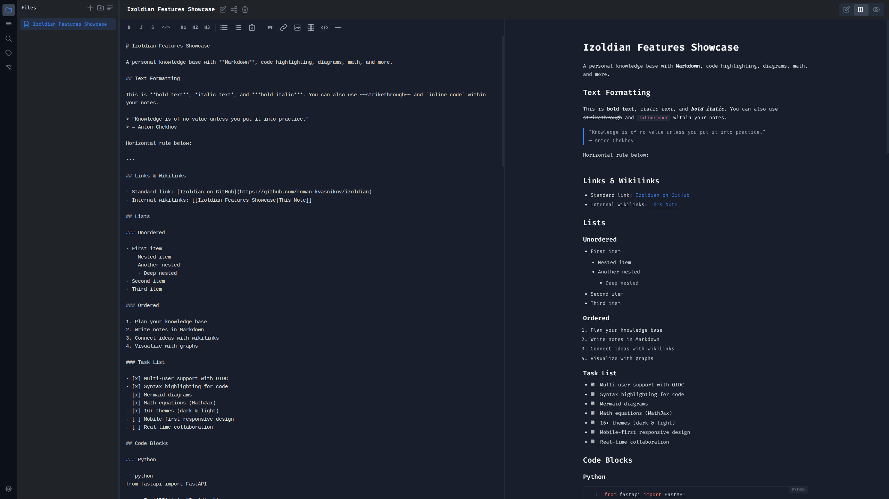

# Izoldian



Self-hosted note-taking and knowledge management app. **Your knowledge under your control.**

## Features

### Editor

- **Markdown editor** with live preview and split view
- **Formatting toolbar** — bold, italic, strikethrough, headings, lists, links, code, tables
- **Keyboard shortcuts** — Ctrl+B, Ctrl+I, Ctrl+S, F2 rename, Ctrl+K quick switch
- **Auto-save** with 1.5s debounce

### Rendering

- **Syntax highlighting** for 30+ languages with line numbers (highlight.js)
- **Mermaid diagrams** — flowcharts, sequence, gantt, pie, ER, and more
- **MathJax** — LaTeX math equations, inline and display mode
- **GFM support** — tables, task lists, strikethrough, autolinks

### Organization

- **File tree** with folders, nested structure, rename, and delete
- **Wikilinks** (`[[note-name]]` / `[[note|display text]]`) for linking notes
- **Interactive knowledge graph** (vis-network) visualizing note connections
- **Tags** extracted from YAML frontmatter with tag-based filtering
- **Full-text search** across all notes
- **Outline panel** with heading navigation

### Media

- **Media browser** — images, PDFs, video, audio displayed in file tree
- **Media viewer** — fullscreen overlay with image preview, PDF iframe, video/audio players
- **Media uploads** up to 50MB (images, audio, video, PDF, ZIP)
- **Wikilink embeds** — `[[image.png]]` renders inline

### Sharing & Auth

- **Note sharing** via public links with unique tokens
- **Multi-user** with isolated data directories per user
- **Internal auth** — username/password with bcrypt + JWT sessions
- **OIDC support** — Authelia, Keycloak, or any OpenID Connect provider
- **Configurable** — disable signup, disable internal auth, OIDC-only mode

### UI/UX

- **16 built-in themes** — dark and light variants
- **Mobile-friendly** — responsive layout with bottom navigation
- **Localization** — English and Russian (extensible via JSON)
- **Landing page** at `/landing` with project overview

## Themes

| Dark                | Light           |
| ------------------- | --------------- |
| Dark (default)      | Light           |
| Dracula             | GitHub Light    |
| Nord                | Solarized Light |
| Monokai             |                 |
| One Dark            |                 |
| Tokyo Night         |                 |
| Catppuccin Mocha    |                 |
| Gruvbox Dark        |                 |
| Solarized Dark      |                 |
| Ayu Dark            |                 |
| Rosé Pine           |                 |
| GitHub Dark Default |                 |
| GitHub Dark Dimmed  |                 |

## Tech Stack

**Backend:** Python, FastAPI, SQLite (aiosqlite), bcrypt, JWT, OIDC (httpx)
**Frontend:** Alpine.js, Tailwind CSS, marked.js, highlight.js, vis-network, MathJax, Mermaid, DOMPurify
**Infrastructure:** Docker, Docker Compose, GHCR, uvicorn

## Quick Start (Docker)

```bash
mkdir izoldian && cd izoldian
curl -O https://raw.githubusercontent.com/roman-kvasnikov/izoldian/master/docker-compose.yml
docker compose up -d
```

Open [http://localhost:8000](http://localhost:8000) and create an account.

## Docker Compose

```yaml
services:
  izoldian:
    container_name: izoldian
    image: ghcr.io/roman-kvasnikov/izoldian:latest
    restart: unless-stopped
    volumes:
      - ./data:/app/data
    ports:
      - 8000:8000
```

## Manual Setup

Requires Python 3.11+.

```bash
cd backend
pip install -r requirements.txt
python main.py
```

## Environment Variables

| Variable                | Default                 | Description                                                 |
| ----------------------- | ----------------------- | ----------------------------------------------------------- |
| `HOST`                  | `0.0.0.0`               | Server bind address                                         |
| `PORT`                  | `8000`                  | Server port                                                 |
| `DATA_DIR`              | `/app/data`             | User data directory                                         |
| `DB_PATH`               | `/app/data/izoldian.db` | SQLite database path                                        |
| `SECRET_KEY`            | auto-generated          | JWT signing key                                             |
| `SESSION_MAX_AGE_DAYS`  | `7`                     | Session expiration (days)                                   |
| `USER_SIGNUP`           | `true`                  | Allow new user registration                                 |
| `DISABLE_INTERNAL_AUTH` | `false`                 | Disable username/password login                             |
| `OIDC_ENABLED`          | `false`                 | Enable OpenID Connect auth                                  |
| `OIDC_ISSUER`           |                         | OIDC provider URL                                           |
| `OIDC_CLIENT_ID`        |                         | OAuth2 client ID                                            |
| `OIDC_CLIENT_SECRET`    |                         | OAuth2 client secret                                        |
| `OIDC_REDIRECT_URI`     |                         | Callback URL (`https://your-domain/api/auth/oidc/callback`) |
| `OIDC_SCOPES`           | `openid profile email`  | OIDC scopes                                                 |
| `CORS_ORIGINS`          | `*`                     | Allowed CORS origins (comma-separated)                      |

## OIDC Setup

1. Set `OIDC_ENABLED=true` and configure the OIDC variables
2. Your OIDC provider must use `client_secret_post` token endpoint auth method
3. Optionally set `DISABLE_INTERNAL_AUTH=true` and `USER_SIGNUP=false` for OIDC-only mode

## API Endpoints

| Method   | Endpoint                    | Description              |
| -------- | --------------------------- | ------------------------ |
| `GET`    | `/api/health`               | Health check             |
| `POST`   | `/api/auth/register`        | Register new user        |
| `POST`   | `/api/auth/login`           | Login with credentials   |
| `GET`    | `/api/auth/me`              | Current user info        |
| `POST`   | `/api/auth/logout`          | Logout                   |
| `GET`    | `/api/auth/auth-config`     | Auth configuration flags |
| `GET`    | `/api/auth/oidc/login`      | Start OIDC flow          |
| `GET`    | `/api/auth/oidc/callback`   | OIDC callback            |
| `GET`    | `/api/notes`                | List all notes           |
| `GET`    | `/api/notes/tree`           | File tree structure      |
| `GET`    | `/api/notes/by-path/{path}` | Get note by path         |
| `POST`   | `/api/notes/by-path/{path}` | Save note content        |
| `DELETE` | `/api/notes/by-path/{path}` | Delete note              |
| `POST`   | `/api/notes/move`           | Move/rename note         |
| `POST`   | `/api/folders`              | Create folder            |
| `DELETE` | `/api/folders/{path}`       | Delete folder            |
| `POST`   | `/api/folders/move`         | Move/rename folder       |
| `GET`    | `/api/search?q=`            | Full-text search         |
| `GET`    | `/api/graph`                | Knowledge graph data     |
| `GET`    | `/api/tags`                 | All tags                 |
| `GET`    | `/api/notes/by-tag/{tag}`   | Notes by tag             |
| `POST`   | `/api/share/{path}`         | Create share link        |
| `DELETE` | `/api/share/{path}`         | Revoke share link        |
| `GET`    | `/api/share/info/{path}`    | Share info for note      |
| `GET`    | `/api/shared-notes`         | List shared notes        |
| `GET`    | `/api/s/{token}`            | Public shared note       |
| `POST`   | `/api/media/upload`         | Upload media file        |
| `GET`    | `/api/media/{path}`         | Get media file           |
| `GET`    | `/api/themes`               | List available themes    |
| `GET`    | `/api/themes/{id}`          | Get theme CSS            |
| `GET`    | `/api/locales`              | List locales             |
| `GET`    | `/api/locales/{id}`         | Get locale JSON          |

## Project Structure

```
izoldian/
├── backend/
│   ├── main.py              # App entry point, middleware, static routes
│   ├── config.py            # Environment configuration (pydantic-settings)
│   ├── database.py          # SQLite schema and connection
│   ├── auth.py              # Auth, sessions, OIDC, user data dirs
│   ├── models.py            # Pydantic request/response models
│   ├── share.py             # Share token management
│   ├── requirements.txt
│   └── routes/
│       ├── auth_routes.py   # Login, register, OIDC, auth-config
│       ├── notes_routes.py  # CRUD, file tree, tags, move
│       ├── folders_routes.py # Create, delete, move/rename folders
│       ├── search_routes.py # Full-text search
│       ├── graph_routes.py  # Knowledge graph (wikilink extraction)
│       ├── share_routes.py  # Note sharing with tokens
│       ├── media_routes.py  # Media upload and serving
│       ├── theme_routes.py  # Theme listing and CSS serving
│       └── locale_routes.py # i18n locale serving
├── frontend/
│   ├── index.html           # Login / register page
│   ├── app.html             # Main application
│   ├── landing.html         # Project landing page
│   ├── izoldian.png         # App icon
│   ├── favicon-96.png       # Favicon 96x96
│   ├── favicon-32.png       # Favicon 32x32
│   ├── favicon-16.png       # Favicon 16x16
│   ├── images/
│   │   └── izoldian.png     # Project screenshot
│   ├── css/
│   │   └── styles.css       # Global styles, theme variables, markdown
│   ├── js/
│   │   └── app.js           # Alpine.js app logic, editor, rendering
│   ├── themes/              # 16 theme CSS files
│   │   ├── dark.css
│   │   ├── light.css
│   │   ├── dracula.css
│   │   ├── nord.css
│   │   ├── monokai.css
│   │   ├── one-dark.css
│   │   ├── tokyo-night.css
│   │   ├── catppuccin-mocha.css
│   │   ├── gruvbox-dark.css
│   │   ├── solarized-dark.css
│   │   ├── solarized-light.css
│   │   ├── ayu-dark.css
│   │   ├── rose-pine.css
│   │   ├── github-dark-default.css
│   │   ├── github-dark-dimmed.css
│   │   └── github-light.css
│   └── locales/             # i18n JSON files
│       ├── en-US.json
│       └── ru-RU.json
├── Dockerfile
├── docker-compose.yml
├── docker-compose.dev.yml
├── .github/
│   └── workflows/
│       └── docker.yml       # CI/CD: build and push to GHCR
└── .gitignore
```

## License

MIT
